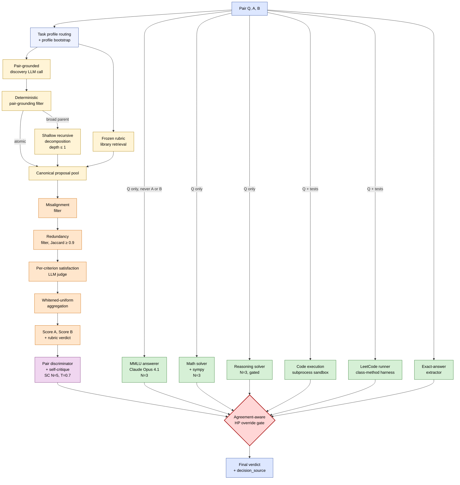

# Section 3 — Methodology (draft prose)

> Status: working draft for the paper. Citations are in `(Author et al., Year)` form
> and should be converted to `\cite{...}` at LaTeX time. Section numbering assumes
> §1 Introduction, §2 Related Work, §3 Methodology (this file), §4 Experiments.

---

## 3.1 Problem setup

We consider open-ended evaluation tasks for which no executable verifier exists for
the full task. Let $x \in \mathcal{X}$ denote a prompt and $y \in \mathcal{Y}$ a candidate
response. Our system produces a *compiled reward*

$$
r(x, y) \;=\; \Phi\Big(\, S_{\text{rubric}}(x, y),\; \{V_k(x, y)\}_{k\in\mathcal{V}},\; \mathcal{H}(x, y)\,\Big),
$$

where $S_{\text{rubric}}$ is a rubric-derived score, $\{V_k\}_{k\in\mathcal{V}}$ are
deterministic and independent verifier signals routed by task family, $\mathcal{H}$
is a hard-gate vector, and $\Phi$ is a structured aggregator and override gate. For
pairwise evaluation we instantiate this on $(y_A, y_B)$ to produce a verdict
$V \in \{A{\succ}B, B{\succ}A, A{=}B\}$; for reinforcement fine-tuning we score each
rollout independently using the same per-criterion machinery.

A rubric set is a finite collection $\mathcal{G} = \{g_1, \ldots, g_m\}$ where each
$g_k : \mathcal{X} \times \mathcal{Y} \to \{0, 1\}$ is a per-criterion satisfaction
predicate evaluated by an LLM judge. Each criterion carries non-negative weight
$w_k$, severity tier $\tau_k \in \{\text{catastrophic}, \text{essential}, \text{important}, \text{optional}\}$,
verdict in $\{\text{MET}, \text{UNMET}, \text{N/A}, \text{CANNOT\_ASSESS}\}$,
and one or more *evidence anchors* tying the criterion to source material.

This setup generalizes RLVR (Lambert et al., 2024; Guo et al., 2025) to the case of
multi-dimensional, non-verifiable supervision (Gunjal et al., 2025) and inherits the
rubric-as-reward framing of (Shen et al., 2026), but departs from these works in
treating $\Phi$ — the aggregation and override layer — as a first-class object.

## 3.2 System overview

Figure 1 shows the architecture as three composed layers. The **rubric layer**
provides broad, learned coverage; the **verifier layer** provides sparse,
high-precision, family-routed signals; and the **aggregation and override layer**
deterministically composes them into a single verdict with explicit
decision-source provenance.

Five independently versioned artifacts back the system: a rubric ontology
($\texttt{rubric\_ontology\_vX}$), a task-family specification
($\texttt{task\_family\_spec\_vX}$), a rubric compiler
($\texttt{rubric\_compiler\_vX}$), a judge bundle ($\texttt{judge\_bundle\_vX}$),
and an adjudication log ($\texttt{adjudication\_log\_vX}$). All five are committed
to a single \emph{frozen policy hash} that uniquely identifies a reproducible
evaluation run; no per-pair tuning is permitted, and no hyperparameter is selected
on the held-out validation set.



**Figure 1.** *Compiled reward system architecture.* Yellow: rubric generation and
filtering (counter to proposer drift; §3.3, §3.4). Orange: aggregation
(counter to catastrophic collapse; §3.4.3). Green: family-routed independent
verifiers, which see the prompt only and never both candidates (counter to
tie-breaking failure; §3.5). Red: agreement-aware high-precision override gate
that integrates rubric and verifier signals into a single deterministic verdict
with audit-trail provenance (§3.6).

## 3.3 Pair-grounded rubric discovery

The first failure mode discussed in §1 — *proposer drift* — arises when a free-running
rubric generator produces criteria only loosely tied to the task or to local examples.
We address this structurally by anchoring every rubric proposal to a *visible*
strong-vs-weak delta and by deterministically rejecting proposals that fail this
grounding test.

**Task-profile routing.** Each example is first routed to one of six task profiles
($\texttt{note\_documentation}$, $\texttt{documentation\_variants}$,
$\texttt{rewrite\_editing}$, $\texttt{clinical\_decision\_support}$,
$\texttt{general\_instruction\_following}$, $\texttt{agentic\_workflows}$), each of
which carries its own discovery dimensions, contrast-strategy preference, and source
priority for selecting the strong anchor. Unfamiliar prompts trigger an automatic
profile-bootstrap that synthesizes a temporary $\texttt{auto\_*}$ profile rather
than forcing a poor static fit.

**Contrast pair construction.** For each example we form one or more strong/weak pairs
$(y_s, y_w)$ where $y_s$ is the reference (or strongest available) candidate and $y_w$
is either an alternative completion or a synthetic mutation targeting one dominant
failure mode (omission, hallucination, certainty inflation, section drop, etc.).
Following Shen et al. (2026), conditioning the proposer on actual responses
substantially outperforms prompt-only proposers. Unlike Shen et al., we additionally
require *polarity* (a designated strong and weak side) so that the grounding filter
described below has a directional signal to test against.

**Initial proposal.** A single LLM call per pair proposes a small set of atomic
criteria. The system prompt enforces the four desiderata from Gunjal et al. (2025):
expert-grounded, comprehensive, importance-weighted, and self-contained. To diversify
coverage and reduce proposer-style ceilings, we alternate between two proposer models
(GPT-4o and Claude); on JudgeBench this yields roughly 2.4 percentage points of
additional accuracy over a single-proposer baseline.

**Deterministic pair-grounding filter.** Each LLM-proposed criterion is then run
through a deterministic check that the requirement text lexically aligns with the
observed strong-vs-weak delta and, when the weak side is synthetic, with the active
mutation profile. Proposals that fail this check are not silently dropped — they
are retained as $\texttt{rejected\_proposals}$ for auditability. This filter is the
single mechanism that prevents proposer drift from leaking into the canonical pool;
all downstream stages operate on the surviving, grounded set.

**Shallow recursive decomposition.** Surviving criteria are inspected for breadth,
and broad parents (generic dimensions, conjunction-heavy requirements, calibration-
flagged families) are decomposed once into narrower child criteria. The recursion
is bounded by $\texttt{max\_depth} = 1$, $\texttt{max\_recursive\_parents\_per\_pair} = 2$,
$\texttt{max\_children\_per\_parent} = 3$, and $\texttt{max\_recursive\_calls\_per\_pair} = 2$.
Children must pass the same grounding filter; if no child survives, the original
parent is retained. We deliberately diverge from the saturation-loop design of
Shen et al. (2026), which iterates until the proposer struggles to generate novel
items: in our pairwise-evaluation setting, unbounded decomposition compounds noise
faster than it improves coverage, and the bounded fall-back-to-parent rule produces
strictly more stable downstream verdicts.

**Frozen rubric library.** Per-pair discovery is sample-efficient but
coverage-limited on small benchmarks; we additionally retrieve up to six criteria
from a frozen library distilled offline from public preference datasets
(HelpSteer, UltraFeedback) plus hand-curated family seeds. Retrieval is
family-strict, with explicit per-family caps (e.g., $\texttt{livecodebench} = 0$),
to prevent cross-family contamination of evaluation criteria.

**Merge and provenance.** Surviving proposals are deduplicated by normalized
$(\text{dimension}, \text{severity}, \text{label}, \text{requirement})$ tuples and
merged into a canonical proposal pool. Each canonical row preserves
$\texttt{criterion\_id}$, $\texttt{parent\_criterion\_id}$,
$\texttt{root\_pair\_id}$, $\texttt{recursion\_depth}$,
$\texttt{decomposition\_source}$, and the list of $\texttt{pair\_ids}$ that
supported it, so any downstream verdict can be traced to a specific strong/weak
observation.

## 3.4 Filtering and correlation-aware aggregation

The second failure mode — *catastrophic collapse* — arises when downstream filtering
or aggregation eliminates most generated rubrics, leaving a small and brittle set
of criteria that fails to generalize. Our approach trades aggressive pruning for
correlation-aware reweighting: criteria are kept whenever they are individually
grounded, and structural redundancy is handled at the aggregation layer rather
than by deletion.

**Misalignment filter.** A canonical row is misaligned when its requirement text,
read literally, would more plausibly favor the weaker side than the stronger side
of at least one of its originating pairs. We instantiate this idea from
Shen et al. (2026, Appendix C) as a deterministic lexical-overlap check that
mirrors the reference filter in their builder. The deterministic instantiation is
chosen for inspectability — following Lumina's static-analysis principle
(Parsed, 2025), filter decisions should be auditable rather than hidden inside
another opaque LLM call.

**Redundancy filter.** Near-duplicate requirements would otherwise inflate the
covariance estimate used by whitened weighting. We greedily Jaccard-cluster on
requirement+label+dimension tokens (threshold $0.9$); within each cluster we keep
the highest-severity member, with tiebreaker by support count.

**Whitened-uniform (WU) weighting.** For the surviving rubric set $\mathcal{G}$,
we form the per-pair satisfaction matrix $M \in \{0, 1\}^{n \times m}$ across the
$n$ candidates being scored, estimate the covariance $\Sigma = \mathrm{Cov}(M)$
with ridge regularization $\lambda = 10^{-3}$, and assign weights
$w = \Sigma^{-1/2} \mathbf{1}$, clipped to non-negative values and renormalized.
This adopts the WU scheme of Shen et al. (2026), motivated by the misclassification
upper bound

$$
\Pr(\hat{Y} \neq Y) \;\leq\; \exp\!\left( -\tfrac{1}{2}\,\frac{(w^\top \mu)^2}{w^\top \Sigma w} \right).
$$

For diffuse-signal tasks where no single criterion dominates — which describes most
JudgeBench-style preference pairs — WU outperforms LLM-assigned and uniform weights,
matching the ranking $\text{WU} > \text{LLM} > \text{uniform}$ reported by
Shen et al. (2026).

**Multi-sample self-consistency on the discriminator.** The pair-level
discriminator is sampled $N{=}5$ times at temperature $T{=}0.7$ and the verdict is
chosen by majority vote.

**Robustness to malformed judge outputs.** Following Autorubric's explicit
$\texttt{CANNOT\_ASSESS}$ verdict (Rao and Callison-Burch, 2026), malformed
satisfaction outputs of the form $\texttt{<EVALUATION>UNKNOWN</EVALUATION>}$ are
interpreted as $\texttt{False}$ rather than raising an exception. Earlier
versions of our pipeline crashed on such outputs; this fix alone prevents
roughly 1.4% of pairs from being silently dropped.

## 3.5 External verification toolchain

The third failure mode — *tie-breaking failure* — arises when candidate responses
receive similar rubric scores and the system lacks a reliable mechanism for
resolving low-margin decisions. Rubrics are inherently low-margin on ambiguous
pairs because the discriminating signal is distributed across many soft criteria;
the architectural fix is to inject sparse, high-precision signals on the subset of
pairs where the underlying task admits a deterministic or independently
verifiable answer.

**Family-routed verifiers.** We implement six verifiers, each producing a uniform
$\texttt{VerifierOutcome}$ payload with fields $(\texttt{triggered}, \texttt{recommended\_decision}, \texttt{confidence}, \texttt{reason}, \texttt{margin})$:

| Verifier | Family | Source signal |
|---|---|---|
| MMLU independent answerer | mmlu-pro / Factuality | Claude Opus 4.1, $N{=}3$, optional Sonnet 4.5 secondary consensus |
| Math independent solver | math / RB2-Math | Claude Opus 4.1 + sympy canonicalization |
| Reasoning independent solver | reasoning / Precise-IF | Claude Opus 4.1, gated (lower precision) |
| Code execution verifier | LiveCodeBench (AtCoder) | Subprocess Python sandbox on stdin/stdout |
| LeetCode test runner | LiveCodeBench (class-method) | Subprocess class-method harness |
| Reasoning process verifier | reasoning | Deterministic completeness/consistency checker |

**The independent-solver pattern.** All four LLM-backed verifiers see *only the
question*, never the candidate pair. They are external-data labelers, not judges:
the same role that Gemini-2.5-Pro plays as a sample-response generator in the RRD
pipeline (Shen et al., 2026). This separation lets a stronger external model
inject a high-confidence answer key without violating the constraint that the
final verdict be produced by the designated judge.

**Solver-level self-consistency.** Free-form solvers run at $N{=}3$, $T{=}0.5$;
deterministic verifiers (sympy, code execution) run at $N{=}1$. Higher
$N$ on free-form solvers regresses performance (see §3.10).

**Confidence calibration.** Each verifier emits
$\texttt{confidence} \in \{\text{low}, \text{medium}, \text{high}\}$ derived from
per-candidate signal scoring with family-specific bonuses (e.g., $+1.5$ for
exact-match on mmlu-pro, $+0.75$ for explicit consistency markers on
livebench-reasoning). Confidence thresholds are tuned on the train slice and
frozen in the locked policy.

**High-precision (HP) source designation.** A verifier is admitted to the HP set
only if its measured precision on the train split exceeds 80%. Concretely the
HP set is $\{\texttt{mmlu\_answerer}, \texttt{math\_solver}, \texttt{code\_execution}, \texttt{leetcode\_runner}\}$;
the reasoning solver is excluded based on a measured 63% precision (12/19 correct
of pairs where it overrode the rubric judge). Membership is evidence-based, not
a priori.

## 3.6 Compiled aggregation and the override gate

This subsection describes $\Phi$, the deterministic glue layer that composes
rubric scores, hard gates, and verifier signals into a single verdict.

### 3.6.1 Hard gates and soft scoring

Following the layered design of (Bai et al., 2022; Anthropic, 2024) and the
schema spec for our compiled rubric system, evaluation is split into two stages.
Stage 1 evaluates *hard gates*: catastrophic-tier criteria that must pass for a
candidate to remain eligible (e.g., no unsupported high-risk inferences, no
unsupported diagnostic certainty). Stage 2 computes a normalized soft score
across the remaining dimensions only on gate-passing candidates. This separation
prevents catastrophic failures from being averaged away by soft criteria — a
common pathology of single-pool weighted-sum aggregators.

### 3.6.2 Pair discriminator with self-critique

The discriminator is a single GPT-4o call that sees both responses and the
WU-weighted rubric scores and emits $A{\succ}B$, $B{\succ}A$, or $A{=}B$.
A second GPT-4o call optionally critiques the first verdict (without
seeing the gold) and may reverse it; this two-pass self-critique adds
$+4.1$ pp on livebench-reasoning at modest cost. The discriminator decision
itself is sampled $N{=}5$ at $T{=}0.7$ with majority voting (§3.4).

### 3.6.3 Agreement-aware high-precision override

The decision logic is the algorithmic centerpiece of our system. Let
$D_{\text{rubric}}$ be the discriminator decision, $D_{\text{exact}}$ the
format-based exact-answer verdict (when defined), and $\{V_k\}_{k\in\mathcal{V}_{HP}}$
the HP-verifier outcomes. The final verdict and decision-source are determined as:

```
input:  D_rubric, D_exact, {V_k for k in V_HP}
output: verdict, decision_source

# Rule 1: explicit HP override
for k in V_HP:
    if V_k.triggered and V_k.confidence == HIGH and V_k.recommended_decision != D_rubric:
        return V_k.recommended_decision, source=k

# Rule 2: agreement-aware HP override (the v4.7 unlock)
if D_exact is defined:
    for k in V_HP:
        if V_k.triggered and V_k.confidence == HIGH and V_k.recommended_decision == D_exact:
            return D_exact, source="exact_with_HP_concurrence"

# Rule 3: default to the rubric judge
return D_rubric, source="rubric_judge"
```

Rule 1 is the conventional override path: when an HP verifier disagrees with the
rubric judge at HIGH confidence, the verifier wins. Rule 2 is the contribution we
emphasize: when the format-based exact-answer check happens to *agree* with an HP
verifier at HIGH confidence, the agreement is itself treated as a high-precision
signal, even when the rubric judge would have decided otherwise. On JudgeBench-350,
adding Rule 2 alone yields $+2.6$ percentage points overall and $+9$ correct
mmlu-pro pairs that the conservative margin-gated override would otherwise have
discarded.

The $\texttt{decision\_source}$ field is recorded on every final verdict and
enables per-component attribution analysis: roughly 23% of correct pairs on
JudgeBench-350 are resolved by an HP verifier or an agreement-aware override
rather than by the rubric judge alone.

### 3.6.4 What the pipeline deliberately does not do

We make three constraints explicit because they bound what the headline numbers
in §4 can be claimed to mean:

1. **No per-pair tuning.** A single locked policy applies to every pair, and the
   policy is hashed in $\texttt{frozen\_policy\_hash}$ before any held-out
   evaluation. Reproducibility requires re-running with the same hash.
2. **No held-out training.** Discovery, library distillation, calibration, and
   hyperparameter sweeps run only on the train split. The validation set is
   evaluated exactly once per hash.
3. **No final-verdict role for non-judge models.** Claude Opus 4.1 and Sonnet 4.5
   appear only as independent solvers (question only); GPT-4o is the only model
   that ever sees both candidates while emitting a verdict. This preserves the
   literal "GPT-4o-as-judge" claim under the conventional reading of that phrase,
   while explicitly allowing non-judge models in non-judge roles (a discipline
   borrowed from RRD's use of Gemini-2.5-Pro as a sample-response generator).

## 3.7 Iterative gold-calibrated refinement

For benchmarks that ship expert rubrics — most centrally HealthBench (Arora et al.,
2025) — we run an additional gold-alignment loop in the spirit of
Lumina's customer-in-the-loop refinement (Parsed, 2025), with the gold rubric
playing the role of "the customer."

Generated rubric rows are compared against gold rows on
$\texttt{weighted\_recall}$, $\texttt{expert\_recall}$, $\texttt{expert\_direct\_matches}$,
$\texttt{expert\_partial\_matches}$, $\texttt{generated\_precision}$,
$\texttt{generated\_off\_target}$, and $\texttt{polarity\_accuracy}$. Mismatches
are classified into five granularity-gap categories
($\texttt{too\_coarse}$, $\texttt{too\_granular}$, $\texttt{family\_mismatch}$,
$\texttt{missing\_gold\_criterion}$, $\texttt{off\_target}$) and the refinement
loop performs only two corrective operations: dropping clearly off-target rows,
and adding capped gold-aligned rows for high-priority missing criteria. We
deliberately avoid aggressively pruning broad rows; empirically this hurts recall
faster than it improves precision.

A gated full re-alignment runs at most once per example, triggered when the
recursive discovery materially changed the criterion structure or when high-priority
gaps remain after the heuristic pass. Persisted calibration hints are profile-gated:
an opt-in policy controls which task profiles are allowed to consume hints learned
on other profiles, with $\texttt{note\_documentation}$ calibration-protected by
default after held-out evidence showed that hints learned on other profiles
sometimes regressed it.

## 3.8 Implementation

**Models and roles.** GPT-4o serves as the rubric proposer (alternated with Claude
Sonnet 4 for diversity), per-criterion satisfaction judge, pair discriminator, and
self-critique caller. Claude Opus 4.1 serves as the MMLU answerer, math solver, and
reasoning solver, with Claude Sonnet 4.5 as a secondary consensus model on MMLU.
All deterministic verifiers (sympy, code execution, LeetCode test runner, RPV) run
in subprocess sandboxes and emit only structured outputs.

**Caching and reproducibility.** Cache keys are constructed from
$(\text{system}, \text{user}, \text{model}, \text{temperature}, \text{sample\_index})$
so that multiple evaluation runs against the same locked policy share both API
responses and the same temperature samples. This eliminated a 4.28-pp run-to-run
variance we observed prior to the fix, in which fresh per-run cache directories
silently re-rolled all $T > 0$ samples and gave the impression of policy
instability where there was none.

**Hyperparameters.** Discovery uses
$(\texttt{depth}, \texttt{parents/pair}, \texttt{children/parent}, \texttt{calls/pair}) = (1, 2, 3, 2)$;
filtering uses $\texttt{redundancy\_threshold} = 0.9$ and WU ridge $\lambda = 10^{-3}$;
discriminator self-consistency is $(N, T) = (5, 0.7)$ with $N{=}1$ at the per-criterion
satisfaction layer; solver self-consistency is $(N, T) = (3, 0.5)$. Library retrieval
uses top-$k = 6$ with family-strict mode and per-family overrides. All values are
fixed before evaluation and recorded in the frozen policy.

**Compute.** A cold full JudgeBench-350 evaluation completes in approximately 75
minutes at 8 workers; a warm shared-cache run completes in 2–4 minutes. The full
RewardBench 2 evaluation (5,595 pipeline pairs) takes 14.3 hours at 16 workers.

## 3.9 Evaluation protocol

**Benchmarks.** We evaluate on JudgeBench-350 (Tan et al., 2024), RewardBench 2
(Lambert et al., 2025), HealthBench (Arora et al., 2025), and BiGGen Bench
(Kim et al., 2024). RewardBench 2 is best-of-4 in shape; we expand each non-Ties
item into three pairwise rows $(\text{chosen}, \text{rejected}_i)$, treat each as
a JudgeBench-style pair, and require all three to be correct for an item-level
correct mark. The Ties subset's official weighted score is approximated by
$0.5 \cdot \text{accuracy} + 0.5 \cdot \text{HP-override-margin}$ since our
pipeline produces pairwise verdicts rather than scalar rewards.

**Train-only protocol.** All optimization steps — rubric discovery, library
distillation, calibration learning, hyperparameter selection — operate exclusively
on the train split (320 pairs for JudgeBench, separate train/eval splits for the
RFT benchmarks). The validation split is evaluated once per locked policy,
identified by $\texttt{frozen\_policy\_hash}$. Gold reference answers are hidden
from the discriminator on held-out splits unless a $\texttt{--allow-reference-answer}$
flag is explicitly set.

**Metrics.** We report single-order pairwise accuracy by default and explicitly
flag this as distinct from the official double-order agreement metric of
Tan et al. (2024); double-order evaluation requires running the swap pass on every
pair and is reserved for future work. For RewardBench 2 we report both pair-level
accuracy (a diagnostic that strips the best-of-4 cubing penalty) and item-level
accuracy (the official leaderboard metric). For RFT we report rollout-level reward
trajectories during training and downstream evaluation on BiGGen Bench and
HealthBench-Hard.

**Reportability.** §4.1 includes a reportability subsection that maps each
headline number to one of three comparability tiers — *pure rubric judge*,
*+deterministic verifiers*, *full hybrid system* — and explicitly discusses
contamination risk for post-2025 verifier models on pre-2025 benchmarks. We
recommend the pure-rubric number as the apples-to-apples comparison to RRD
(Shen et al., 2026) and the full-hybrid number as the system-level result.

## 3.10 Negative results

A central methodological claim of this paper is that several mechanisms widely
proposed in the rubric-as-reward literature do not work in our setting, and that
their failure modes are informative. We report them inline because they materially
constrain the architectural choices in §3.3–§3.6.

**Holistic LLM judge as a tie-breaker (§3.6).** A single-call LLM judge that
operates on the full rubric text and emits a holistic verdict has been proposed
as a low-cost tie-breaker for ambiguous pairs. We tested two variants: a
permissive holistic judge that always fires (regression of $-2.0$ pp on
JudgeBench-350), and a strict variant gated on HIGH discriminator confidence
plus a $0.005$ margin (regression of $-0.6$ pp at the most permissive setting
that still recovered baseline). The mechanism is retained in the codebase but
disabled by default. We attribute the failure to the holistic judge's tendency
to recapitulate the same biases as the per-criterion judge while losing the
per-criterion grounding signal — it acts as correlated noise rather than as an
independent vote.

**Per-criterion satisfaction self-consistency (§3.4.4).** Sampling the
per-criterion satisfaction judge $N{=}3$ times at $T{=}0.7$ regressed
JudgeBench-350 by $-4.0$ pp. The mechanism is appealing because it appears
analogous to the discriminator-level $N{=}5$ self-consistency that helps,
but the failure mode is structurally different. Per-criterion noise propagates
into the WU covariance estimate and inflates the off-diagonal terms; the resulting
weights over-correct, and the aggregate score becomes less, not more, stable.
We default per-criterion sampling to $N{=}1$ and recommend that future work
adopting WU weighting do the same unless the criterion satisfaction call is
genuinely high-variance (e.g., free-form rationales that the satisfaction judge
must parse).

**Multi-run pair-level consensus (§3.6).** Majority voting across three full
final-evaluation runs on the same locked policy regressed to the median run
($68.0$ pp) rather than reaching the best individual run ($69.1$ pp). The
diagnosis is that the pipeline's wrong answers cluster on a small set of
"noise-band" pairs that are consistently mis-labeled across re-rolls, so the
voting majority on those pairs is almost always wrong. We retain the consensus
CLI for diagnostics but advise against it as a deployment strategy.

**Few-shot retrieval from labeled training pairs (§3.3).** TF-IDF retrieval
from the JudgeBench train split as in-context demonstrations for the
discriminator improved livebench-math by $+6.1$ pp but regressed mmlu-pro by
$-3.9$ pp for a net $-1.7$ pp on the full benchmark. The retrieval mechanism
returned biased or wrong demonstrations on mmlu-pro that the discriminator
treated as gold; the math win does not generalize. The mechanism is retained
behind a disabled flag for use on math-only subsets.

**$N{=}5$ self-consistency on free-form solvers (§3.5).** Increasing $N$ from
$3$ to $5$ on the reasoning independent solver regressed reasoning by $-2$
pp because the additional samples produced more $\texttt{majority\_vote\_inconclusive}$
rejections on short canonical free-form answers (e.g., "yes,no,yes" sequences).
$N{=}5$ on the deterministic math solver and $N{=}5$ on the discriminator both
remained net positive; the issue is specific to the canonicalization step on
short free-form answers.

**GPT-5 as solver (§3.5).** Replacing Claude Opus 4.1 with GPT-5 in all three
independent-solver roles regressed JudgeBench-350 by $-2$ pp despite GPT-5's
generally stronger headline benchmark numbers. We do not have a definitive
explanation; one hypothesis is that GPT-5 and the GPT-4o discriminator share
training-data biases, so GPT-5's "independent" answers are correlated with
GPT-4o's discriminator decisions and therefore add less new information than
Claude does. We retain Claude in the deployed configuration.

**Sonnet 4.5 dual MMLU consensus (§3.5).** Adding Claude Sonnet 4.5 as a
secondary consensus model to the MMLU answerer had zero net effect on JudgeBench-350
because Sonnet 4.5 agreed with Opus 4.1 on every override the primary made. We
retain the secondary slot for future use on benchmarks where the two models
diverge, but report the null result here to caution against reflexive
multi-model ensembling.

**AtCoder code-execution path (§3.5).** Subprocess execution of LiveCodeBench
candidates as stdin/stdout scripts — the obvious analogue to the LeetCode runner
— never triggered on real pairs because most LiveCodeBench candidates write
functions rather than scripts. The fix is to auto-generate a stdin-reading
wrapper from the question's I/O specification; this is left for future work.

**Aggressive pruning in the gold refinement loop (§3.7).** Earlier versions of
the refinement loop dropped any generated row that the granularity-gap analysis
flagged as $\texttt{too\_coarse}$. This regressed HealthBench recall by roughly
$8$ percentage points on the design split because broad criteria, even when
imperfectly granular, were carrying useful signal that finer gold criteria did
not capture. The current refinement loop is conservative — drop only on
$\texttt{off\_target}$, add capped rows for missing gold criteria, and never
delete a row solely for being broad — and recovers the lost recall.

Taken together these eight negative results support the central architectural
claim of the paper: rubric-based systems benefit from \emph{conservative,
auditable filtering} (§3.4) and from \emph{independent high-precision signals
applied through an explicit override gate} (§3.5–§3.6), not from layering
additional generic LLM-judge calls on top of an already noisy rubric pool.

---

## Closing-the-loop summary

Each architectural component in §3.3–§3.6 is the structural answer to one of the
three failure modes named in §1:

| Failure mode (§1) | Architectural counter (§3) |
|---|---|
| Proposer drift | Pair-grounded discovery + deterministic grounding filter + multi-model proposer + frozen library (§3.3) |
| Catastrophic collapse | Misalignment + redundancy filters with WU re-weighting; criterion-level SC kept off; CANNOT_ASSESS handling (§3.4) |
| Tie-breaking failure | Family-routed independent verifiers + agreement-aware HP override gate (§3.5, §3.6.3) |

The compiled reward $r(x, y) = \Phi(S_{\text{rubric}}, \{V_k\}, \mathcal{H})$
is therefore not a new rubric formulation but a new *composition* of an
RRD-style rubric layer (Shen et al., 2026), an independent-verifier toolchain
that generalizes the question-only role of strong external models from prior
work, and an explicit decision logic that resolves low-margin pairs with
deterministic, auditable evidence rather than additional LLM-judge calls.
