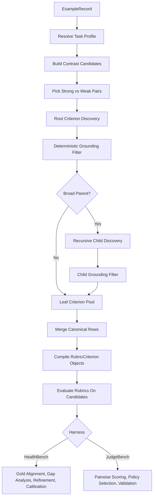

# Compiled Rubric Generation System Explained

## Purpose
This document explains the compiled rubric generation system as it exists in this repository today.

It is a companion to:

- `docs/spec/compiled_rubric_system.md`, which describes the intended design
- `docs/workflows/current_recursive_pipeline.md`, which describes the current recursive implementation at a high level

The short version is:

- the system does not treat evaluation as one monolithic judge prompt
- it tries to *compile* a local rubric for each task instance from visible strong-vs-weak differences
- it keeps the rubric atomic, auditable, and reusable
- it can then score that rubric in different ways depending on the benchmark or harness

This document focuses on the mental model, the runtime flow, the main files, and the gap between the target architecture and what is already implemented.

## One-Sentence Mental Model
The compiled rubric system turns a task instance plus a stronger answer and weaker alternatives into a small, grounded checklist of atomic criteria, then uses that checklist for evaluation, alignment, or policy learning.

## Why This System Exists
The repository already has an `RRD`-style pipeline for recursive rubric discovery. The compiled rubric system is a sibling architecture that is more structured and more artifact-oriented.

The motivation is to separate:

- what quality means for a task family
- how that quality is instantiated for one concrete example
- how the resulting rubric is scored or aligned

That separation makes the system more auditable and easier to reuse across:

- medical note evaluation
- documentation variants
- rewriting and editing tasks
- clinical decision-support tasks
- general instruction-following tasks
- agentic workflow outputs
- benchmark-specific harnesses like HealthBench and JudgeBench

## Core Idea: "Compile" Instead of "Just Judge"
In a simple LLM-as-a-judge setup, one prompt directly compares outputs and emits a score.

In the compiled rubric system, the process is split into stages:

1. understand what kind of task this is
2. build stronger vs weaker contrasts for the same task instance
3. discover atomic criteria that explain the difference
4. filter those criteria deterministically so only grounded ones survive
5. optionally decompose broad criteria into narrower children
6. merge the surviving leaf criteria into an example-local rubric
7. evaluate or align that rubric in a benchmark-specific way

That is why the system is called "compiled": it builds a case-specific checklist from structured inputs rather than relying on one generic scoring prompt.

## The Two Levels To Keep In Mind
There are two overlapping descriptions of the system in this repo.

### 1. Target Architecture
The target architecture lives in `docs/spec/compiled_rubric_system.md`.

That spec describes a layered stack:

- a documentation contract or task policy layer
- universal safety or correctness checks
- reusable task-family templates
- a case-instantiated atomic checklist

It also proposes versioned artifacts like:

- `rubric_ontology_vX`
- `note_family_spec_vX`
- `rubric_compiler_vX`
- `judge_bundle_vX`
- `adjudication_log_vX`

### 2. Current Implementation
The current implementation lives mainly in:

- `rubric_gen/compiled/task_profiles.py`
- `rubric_gen/compiled/profile_bootstrap.py`
- `rubric_gen/compiled/contrast_strategies.py`
- `rubric_gen/compiled/discovery.py`
- `rubric_gen/compiled/healthbench_eval.py`
- `rubric_gen/compiled/gold_refinement.py`
- `rubric_gen/compiled/gold_standards.py`
- `rubric_gen/compiled/judgebench_eval.py`

What exists today is best described as:

- task-general
- shallowly recursive
- strongly artifacted
- example-local rather than globally ontology-updating

So the spec is the north star, and the compiled modules are the current working system.

## Main Runtime Objects
The central dataclasses are defined in `rubric_gen/types.py`.

### `ExampleRecord`
`ExampleRecord` is the normalized unit of work for the discovery pipeline.

It contains:

- task identity and dataset metadata
- the task prompt
- optional conversation or source context
- a reference artifact
- optional weaker variants such as augmented or truncated artifacts
- task profile and task family identifiers
- free-form metadata

This is the object the discovery pipeline treats as "the example."

### `CandidateNote`
`CandidateNote` represents one candidate artifact for the example.

A candidate can be:

- the strong reference artifact
- a model-generated alternative
- a truncated artifact
- a synthetic mutation

The important point is that discovery happens over *pairs of candidates*, not over one artifact in isolation.

### `RubricCriterion`
`RubricCriterion` is the executable criterion that survives discovery.

It stores:

- the criterion text
- its stage of origin
- recursion depth
- parent linkage when it came from decomposition
- coverage and filtering metadata

This is the bridge between discovery and scoring.

### `RubricEvaluation`
`RubricEvaluation` stores whether a particular candidate satisfied a particular criterion, along with any judge metadata.

### Benchmark-Specific Gold Objects
For gold-alignment workflows, `rubric_gen/compiled/gold_standards.py` adds:

- `GoldCriterion`
- `GoldAlignmentArtifact`

These let the system compare generated criteria to benchmark-provided expert rubrics in a normalized way.

## Main Modules And What They Do

### `rubric_gen/compiled/task_profiles.py`
This module defines the built-in task profiles.

A `TaskProfile` says:

- what kind of artifact this task produces
- what prompt family it belongs to
- what dimensions discovery should think in
- which artifact sources should be preferred as the "strong" anchor
- which contrast strategy should be used

Built-in profiles include:

- `note_documentation`
- `documentation_variants`
- `rewrite_editing`
- `clinical_decision_support`
- `general_instruction_following`
- `agentic_workflows`

This is the main place where the system separates "task family semantics" from the rest of the pipeline.

### `rubric_gen/compiled/profile_bootstrap.py`
This module handles ambiguous or novel tasks.

If a task does not cleanly fit one built-in profile, the system can bootstrap a dynamic `auto_*` profile by looking at features such as:

- structure markers
- action language
- evidence and rationale language
- constraints
- stepwise workflow cues
- tool-result cues
- rewrite signals
- answer-format signals
- multiple-choice signals
- code-task signals

The bootstrap path does two important things:

- it chooses a reasonable parent profile instead of forcing a bad static fit
- it synthesizes a dynamic profile and matching contrast strategy tailored to the observed task distribution

This is why the pipeline can operate outside pure note-generation tasks.

### `rubric_gen/compiled/contrast_strategies.py`
This module decides how to build weaker contrasts.

The compiled rubric system needs visible deltas between a stronger artifact and a weaker one. Contrast strategies create those weaker artifacts.

The system supports:

- built-in mutation families
- task-profile-specific mutation bundles
- grounding hints attached to each mutation

Examples of mutations include:

- removing structure markers
- dropping action items
- dropping supporting evidence
- dropping constraints
- dropping steps
- dropping tool results
- dropping verification or failure handling
- adding unsupported detail
- inflating certainty
- corrupting final answers for exact-answer tasks

These mutations are not only used to create weak candidates. They also provide narrow grounding hints that the discovery step can use to stay focused on the actual observed delta.

### `rubric_gen/compiled/discovery.py`
This is the core discovery engine.

It does the heavy lifting:

- pick strong-vs-weak pairs
- prompt the model for candidate criteria
- filter the results deterministically
- recurse on broad parents
- merge surviving leaves

This module is where the compiled rubric system becomes an actual compiler.

### `rubric_gen/compiled/healthbench_eval.py`
This module wraps the discovery engine in a gold-alignment harness for HealthBench.

It:

- routes examples into task profiles
- runs the same recursive discovery logic
- compares generated criteria with expert criteria
- classifies granularity problems
- refines generated rows conservatively
- produces calibration hints and summaries

This is the main "gold-driven learning" path in the current system.

### `rubric_gen/compiled/gold_refinement.py`
This module analyzes mismatches between generated rubrics and gold rubrics.

It introduces concepts like:

- granularity gaps
- family mismatches
- missing gold criteria
- off-target generated rows
- prompt nudges
- dimension-family bias suggestions

It is the closest thing the current implementation has to a run-local feedback loop.

### `rubric_gen/compiled/judgebench_eval.py`
This module reuses the same core discovery stack for JudgeBench, but the scoring target is different.

Instead of aligning to gold rubric rows, it:

- joins local train/validation subsets to official pairwise JudgeBench data
- discovers rubrics from stronger-vs-weaker contrasts
- turns canonical rows into executable rubric criteria
- evaluates those criteria on response A and response B
- aggregates them into pairwise decisions
- learns a frozen routing and recursion policy on the 80-example design split
- validates that frozen policy on the 270-example validation split

So the same discovery engine supports both:

- gold-rubric alignment workflows
- pairwise benchmark scoring workflows

## End-To-End Flow

### 1. Normalize The Example
The system begins with an `ExampleRecord`.

At this stage the system needs:

- task text
- source context if any
- one or more artifact variants
- metadata that can help task resolution

The example may come from notes, rewrites, agentic traces, benchmark completions, or pairwise answer sets.

### 2. Resolve The Task Profile
The system decides what sort of task it is dealing with.

This can happen in two ways:

- a built-in profile is selected directly
- an `auto_*` profile is bootstrapped dynamically

This step matters because it controls:

- which dimensions discovery should prefer
- which contrast mutations are relevant
- what counts as the right strong source
- what prompt framing the discovery model will receive

Without task profiles, all tasks would be collapsed into one noisy "generic quality" space.

### 3. Build Contrast Candidates
The system then builds a local pool of candidate artifacts for the same example.

The pool can include:

- the reference artifact
- model-generated or alternative completions
- truncated artifacts
- synthetic weak mutations

The purpose is to expose visible local deltas. The system is not trying to infer rubric criteria from a single good answer in a vacuum.

### 4. Pick Strong vs Weak Pairs
For each local discovery problem, the pipeline chooses:

- one stronger artifact
- one or more weaker artifacts

Each pair asks the same question:

> What atomic criterion explains why the stronger artifact is better than the weaker one for this exact task instance?

That framing is the conceptual core of the system.

### 5. Root Discovery
For each pair, the pipeline makes a discovery LLM call.

The prompt asks for criteria that are:

- atomic
- binary-leaning
- grounded in the visible difference
- self-contained

The model is not asked for a full essay rubric. It is asked for a short list of local checks that explain the pairwise advantage.

### 6. Deterministic Grounding Filter
Model output is not accepted blindly.

Promoted criteria must survive a deterministic grounding filter that checks alignment with:

- the actual strong-vs-weak text delta
- the active mutation profile when the weak artifact is synthetic
- allowed and blocked phrases for mutation families that need extra control

This step is crucial because it keeps the system from turning generic model preferences into fake rubric concepts.

Rejected proposals are preserved in artifacts rather than discarded silently.

### 7. Recursive Decomposition
After the first pass, the system looks for criteria that are still too broad.

The recursion is intentionally shallow and controlled by `RecursiveDiscoveryConfig`, with knobs such as:

- `max_depth`
- `max_recursive_parents_per_pair`
- `max_children_per_parent`
- `max_recursive_calls_per_pair`

Typical reasons to recurse:

- the criterion is generic, like completeness or coverage
- the requirement is conjunction-heavy
- the label is broad
- calibration feedback suggests this family tends to be under-decomposed

When recursion fires:

1. the broad parent is sent back for decomposition
2. narrower child criteria are proposed
3. those children go through the same grounding filter
4. grounded children replace the parent as leaves
5. if the children fail, the original parent is kept

This "parent survives if decomposition fails" rule is what makes the recursion safe rather than destructive.

### 8. Merge Canonical Leaves
After root discovery and optional recursion, the system merges surviving leaf criteria into an example-level canonical pool.

The current merge behavior is intentionally simple:

- normalize and deduplicate similar rows
- preserve counts and provenance
- preserve recursion metadata

The output is not a persistent global ontology. It is an example-local canonical rubric for this run.

### 9. Convert Canonical Rows Into Executable Rubrics
The canonical rows are then turned into `RubricCriterion` objects that can be evaluated.

At this point the system has effectively compiled a case-local checklist.

This is where the pipeline transitions from:

- "discover possible criteria"

to:

- "evaluate concrete criteria on candidate artifacts"

### 10. Evaluate Rubrics On Candidates
Each rubric is checked against one or more candidates.

Depending on the harness, the evaluation can be:

- generic LLM yes/no rubric satisfaction
- heuristic or deterministic overrides for special task types

For example, the JudgeBench path now includes deterministic handling for exact-answer correctness cases and downweighting of irrelevant code-style rubrics in some code tasks.

### 11. Aggregate, Align, Or Score
After rubric evaluations exist, the final stage depends on the harness.

#### HealthBench Path
HealthBench uses expert criteria as a gold target.

The system:

- compares generated rows to normalized gold rows
- computes pre-refinement alignment metrics
- classifies granularity gaps
- performs conservative gold-guided refinement
- optionally performs a gated full post-refinement realignment
- writes calibration hints and reports

#### JudgeBench Path
JudgeBench uses pairwise labels rather than gold criterion rows.

The system:

- scores response A and response B with the discovered rubric
- aggregates by uniform and whitened-uniform weighting
- selects the best train-time policy on the 80-example split
- freezes that policy
- validates it on the 270-example split

## Data Products And Artifacts
One of the strongest parts of this system is artifact preservation.

The pipeline writes structured outputs rather than only emitting one final score.

Depending on the harness, artifacts can include:

- routing decisions
- per-example candidates
- raw root proposals
- promoted and rejected proposals
- recursive child proposals
- canonical merged rows
- rubric evaluations
- train or validation summaries
- refinement actions
- granularity gap reports
- calibration hints
- cache files for discovery and scoring

Typical artifact roots include:

- `artifacts/compiled_discovery_runs/`
- `artifacts/compiled_healthbench_runs/`
- `artifacts/compiled_judgebench_runs/`

This artifact-first approach is part of the system design, not an afterthought.

## What "Calibration" Means Here
Calibration in this codebase does not mean only probability calibration.

It mostly means:

- learning which rubric families are often missing
- learning where generated criteria are too coarse
- deriving reusable prompt nudges or family bias hints
- optionally reusing those hints for compatible task profiles

Calibration reuse is intentionally gated by profile so that one task family does not accidentally poison another.

For example, `note_documentation` is protected more conservatively than generic task families.

## How The System Generalizes Across Domains
The system started from clinical note quality, but the implementation is deliberately broader now.

It generalizes by combining:

- task profiles
- dynamic profile bootstrap
- task-specific contrast strategies
- discovery prompts specialized by profile
- shallow recursive decomposition

That means the same discovery skeleton can be reused for:

- structured notes
- summaries and documentation artifacts
- rewrites
- tool-grounded workflows
- exact-format and exact-answer tasks
- benchmark-specific pairwise judging

The generalization mechanism is not "use one universal prompt." It is "use one universal pipeline with task-aware routing and controlled local specialization."

## What The Current System Does Well
Today the compiled rubric system already has several strong properties.

### It is auditable
The system preserves:

- promoted vs rejected rows
- recursive provenance
- run summaries
- cache records
- gold-gap diagnostics

### It is conservative
The recursion is bounded.

Broad criteria are only decomposed selectively, and failed decomposition falls back to the parent instead of destroying it.

### It is reusable
The same discovery core can feed multiple harnesses.

### It is more structured than flat rubric banks
Even without a persistent ontology rewrite, the system is more explicit than a one-shot rubric generation baseline.

## What The Current System Does *Not* Do Yet
The spec is ahead of the implementation in several areas.

### No persistent global ontology rewrite
The current implementation merges criteria locally for a run or example, but it does not maintain a self-updating canonical global hierarchy.

### No universal hard-gate vs soft-score compiler
The spec strongly emphasizes a two-stage hard-gate plus soft-score architecture. The current code has severity tiers and benchmark-specific logic, but not a fully universal compiled hard-gate layer across all tasks.

### No fully recursive convergence process
The recursion is shallow and budgeted. It does not repeatedly refine until convergence.

### No first-class evidence-anchor framework everywhere
The spec envisions explicit evidence anchors as a common contract. The implementation has strong grounding and provenance, but not a fully uniform evidence-anchor object throughout the whole pipeline.

### No fully persistent adjudication layer
There are alignment and refinement artifacts, but not yet a complete standalone adjudication-log workflow matching the spec's long-term target.

## The Simplest Correct Summary
If you want the simplest technically accurate summary of the system, it is this:

> The compiled rubric generation system is a task-aware, artifact-heavy, shallowly recursive rubric compiler.
>
> It resolves the task type, creates strong-vs-weak contrasts, discovers grounded atomic criteria, decomposes broad ones when needed, merges them into an example-local rubric, and then uses that rubric in benchmark-specific evaluation loops such as gold alignment or pairwise scoring.

## Practical Reading Order
If someone new to the repo wants to understand the system efficiently, this is the best order:

1. `docs/spec/compiled_rubric_system.md`
2. `docs/workflows/current_recursive_pipeline.md`
3. `rubric_gen/types.py`
4. `rubric_gen/compiled/task_profiles.py`
5. `rubric_gen/compiled/profile_bootstrap.py`
6. `rubric_gen/compiled/contrast_strategies.py`
7. `rubric_gen/compiled/discovery.py`
8. `rubric_gen/compiled/healthbench_eval.py`
9. `rubric_gen/compiled/gold_refinement.py`
10. `rubric_gen/compiled/judgebench_eval.py`

## Architecture Sketch

## Bottom Line
The compiled rubric generation system is the repository's structured rubric engine.

Its defining characteristics are:

- task-aware routing instead of one universal scoring prompt
- contrastive discovery instead of isolated rubric brainstorming
- deterministic grounding filters instead of blind trust in LLM output
- shallow recursive decomposition instead of flat rubric lists
- artifact preservation instead of opaque end scores
- benchmark-specific scoring harnesses on top of one shared discovery core

That combination is what makes it a rubric generation *system* rather than just a rubric prompt.
