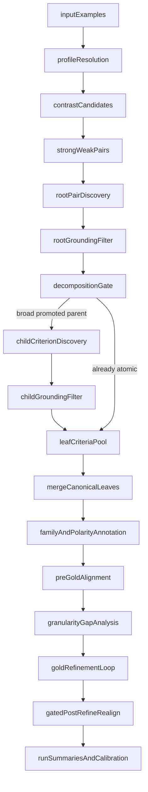

# Current Recursive Pipeline Overview

## Purpose
This document explains what the current compiled rubric pipeline does today.

The system now has two connected layers:

- a task-general rubric discovery engine that can work across note writing, documentation variants, rewrites,
  clinical decision-support tasks, general instruction following, and agentic workflow outputs
- a HealthBench-based gold evaluation and calibration harness that measures how well generated criteria match
  expert rubrics and uses those comparisons to refine the current run and learn reusable calibration hints

The important nuance is that the pipeline is now shallowly recursive at discovery time, but it is still
run-local rather than a fully self-updating global ontology system.

## High-Level Architecture

## Main Code Areas
- `rubric_gen/compiled/task_profiles.py`
  - built-in task profiles and task-profile inference
- `rubric_gen/compiled/profile_bootstrap.py`
  - automatic bootstrap path for new or ambiguous domains
- `rubric_gen/compiled/contrast_strategies.py`
  - strong/weak contrast candidate construction
- `rubric_gen/compiled/discovery.py`
  - pair-level criterion generation, grounding filter, shallow recursive decomposition, merge
- `rubric_gen/compiled/healthbench_eval.py`
  - HealthBench routing, discovery, gold comparison, refinement, summaries
- `rubric_gen/compiled/gold_standards.py`
  - generic gold-provider abstractions
- `rubric_gen/compiled/gold_refinement.py`
  - granularity-gap classification, refinement, calibration hints, profile eligibility policy

## Part 1: Task-General Discovery Pipeline

### 1. Resolve The Task Profile
Each run starts by deciding what kind of task it is working on.

Built-in profiles include:

- `note_documentation`
- `documentation_variants`
- `rewrite_editing`
- `clinical_decision_support`
- `general_instruction_following`
- `agentic_workflows`

Each profile defines:

- the artifact label and artifact kind
- the default task prompt
- the preferred contrast strategy
- the expected discovery dimensions
- the source priority for selecting strong examples

If the task is unfamiliar or ambiguous, `profile_bootstrap.py` can synthesize an `auto_*` profile and
matching contrast strategy instead of forcing a bad fit to a static profile.

### 2. Build Contrast Candidates
The pipeline does not generate rubrics from a single artifact in isolation. It generates criteria from
visible differences between a stronger artifact and weaker contrast artifacts for the same task instance.

Contrast candidates may include:

- the reference or ideal artifact
- augmented or truncated artifacts
- synthetic mutations targeted at one dominant failure mode

The goal is to expose meaningful local differences that the rubric can describe.

### 3. Select Strong vs Weak Pairs
For each example, the system picks:

- one strong anchor artifact
- one or more weaker artifacts

Each strong/weak pair becomes a local discovery problem:

"What atomic criterion explains why the stronger artifact is better for this task instance?"

### 4. Root Pair Discovery
For each pair, the system makes one root LLM call that proposes a small set of atomic criteria.

The root prompt includes:

- task context
- stronger artifact
- weaker artifact
- optional mutation grounding hints
- optional calibration guidance if that task profile is eligible for persisted calibration reuse

The prompt asks for criteria that are:

- atomic
- grounded in the visible pair delta
- self-contained
- binary-leaning

### 5. Deterministic Pair Grounding Filter
LLM output is not trusted blindly.

The root proposals pass through a deterministic grounding filter that checks whether each proposal is
actually aligned with:

- the strong-vs-weak text delta
- the active mutation profile, when the weak artifact is synthetic
- allowed/blocklisted phrase guards for certain mutation families

Rejected rows are preserved in artifacts for auditability.

### 6. Shallow Recursive Decomposition
This is the new recursive layer.

After root filtering, the system inspects promoted parent criteria and only recurses on broad parents.
The first version is intentionally bounded by a `RecursiveDiscoveryConfig`, with defaults such as:

- `max_depth = 1`
- `max_recursive_parents_per_pair = 2`
- `max_children_per_parent = 3`
- `max_recursive_calls_per_pair = 2`

Parents are considered for decomposition when they look too broad, for example:

- generic dimensions like completeness or content coverage
- conjunction-heavy requirements
- long requirements
- broad labels such as "main next steps covered"
- calibration-guided signals that the family tends to be too coarse

When decomposition is triggered:

1. the system asks for narrower child criteria for that parent
2. the child proposals are re-run through the same deterministic grounding filter
3. only grounded child criteria survive into the leaf pool
4. if no child survives, the original parent is kept

This design keeps recursion conservative:

- recursion can improve granularity
- failed or off-target decomposition does not destroy the parent criterion
- cost remains bounded

### 7. Leaf Merge And Canonicalization
After recursion, only the surviving leaf criteria are merged into the canonical proposal pool for the example.

The current merge step is still simple:

- deduplicate by normalized dimension, severity, label, and requirement
- preserve counts and provenance
- preserve recursive metadata such as `criterion_id`, `parent_criterion_id`, `root_pair_id`,
  `recursion_depth`, `recursion_reason`, and `decomposition_source`

The system does not yet rewrite a persistent global ontology during this step.

## Part 2: HealthBench Gold Evaluation And Calibration

### 1. Route HealthBench Examples Into Task Profiles
The HealthBench harness first routes each example into a task profile while also preserving the old note-only
regression slice.

That means one benchmark can simultaneously answer:

- how the generalized pipeline behaves across multiple task types
- whether note-documentation performance regressed

### 2. Run The Same Recursive Discovery Logic
For each routed HealthBench example, the harness:

- builds the strong anchor from the ideal or reference completion
- uses alternative completions as weak contrasts
- runs the same `discover_pair_criteria(...)` wrapper
- merges the resulting recursive leaves into example-level generated criteria

This keeps generic discovery behavior and benchmark discovery behavior aligned.

### 3. Annotate Generated Rows
Merged criteria are normalized into generated rows with:

- family labels
- polarity labels
- recursive provenance
- refinement provenance when applicable

These are the rows compared against gold expert criteria.

### 4. Pre-Refinement Gold Alignment
The HealthBench gold provider normalizes expert rubrics into a common format and compares generated rows
against them.

This produces pre-refinement metrics such as:

- `weighted_recall`
- `expert_recall`
- `expert_direct_matches`
- `expert_partial_matches`
- `generated_precision`
- `generated_off_target`
- `polarity_accuracy`

### 5. Granularity Gap Analysis
After pre-alignment, the system classifies mismatches into categories such as:

- `too_coarse`
- `too_granular`
- `family_mismatch`
- `missing_gold_criterion`
- `off_target`

This is the diagnostic step that tells the system how generated rubrics differ from gold rubrics.

### 6. Gold-Guided Refinement Loop
The refinement loop works at the example level.

It can:

- drop clearly off-target generated rows
- add capped gold-aligned rows for missing or mis-granular high-priority gold criteria

The current refinement policy is conservative:

- it no longer aggressively drops broad rows just because they are broad
- it prefers preserving recall over over-pruning

### 7. Heuristic Post-Refinement Rescore Plus Match Preservation
After refinement, the default post-refinement pass uses heuristic alignment for speed.

To avoid losing legitimate matches from the original pre-refinement alignment, the system preserves earlier
direct and partial matches whenever they still map cleanly onto the refined generated rows.

This creates a pre-alignment floor so heuristic rescoring does not accidentally forget useful coverage.

### 8. Gated Post-Refinement Full Realignment
This is the new recursive feedback gate on the HealthBench side.

After the heuristic post-refinement pass, the evaluator can now perform one extra full realignment when:

- recursive discovery materially changed the criterion structure for the example, or
- high-priority gold `missing_gold_criterion` or `family_mismatch` gaps still remain

That keeps the benchmark meaningfully iterative without paying full LLM realignment cost at every refinement step.

### 9. Aggregate Reports And Calibration Output
The harness writes:

- per-example discovery artifacts
- per-example refinement artifacts with pre/post alignment and metadata
- aggregated pre/post comparison summaries
- family coverage summaries
- disagreement samples
- granularity reports
- calibration hints

Calibration hints are derived mainly from pre-refinement granularity reports and may include:

- prompt nudges
- dimension-to-family bias suggestions
- split-bias families
- merge-bias families
- drop families

## Persisted Calibration Reuse
Persisted calibration is now opt-in by task profile rather than globally applied.

The system can load:

- `calibration_hints.json`
- `calibration_profile_policy.json`

The policy determines which task profiles are allowed to consume persisted calibration guidance.

This protects sensitive profiles, especially `note_documentation`, from being harmed by calibration reuse
that helped other profiles but not notes.

In practice, this means:

- prompt nudges only apply for eligible profiles
- family overrides only apply for eligible profiles
- note-documentation stays protected unless held-out evidence shows it is safe

## What The Pipeline Produces

### Generic Discovery Runs
Standalone discovery writes artifacts under:

- `artifacts/compiled_discovery_runs/<run_name>/examples/`
- `artifacts/compiled_discovery_runs/<run_name>/summaries/`
- `artifacts/compiled_discovery_runs/<run_name>/cache/`

Per-pair artifacts now include:

- raw root proposals
- promoted root proposals
- rejected root proposals
- promoted leaf proposals after recursion
- rejected child proposals
- recursion statistics
- recursion steps and grounding details

### HealthBench Evaluation Runs
HealthBench runs write artifacts under:

- `artifacts/compiled_healthbench_runs/<run_name>/routing/`
- `artifacts/compiled_healthbench_runs/<run_name>/subset/`
- `artifacts/compiled_healthbench_runs/<run_name>/discovery/`
- `artifacts/compiled_healthbench_runs/<run_name>/refinement/`
- `artifacts/compiled_healthbench_runs/<run_name>/summaries/`
- `artifacts/compiled_healthbench_runs/<run_name>/calibration/`
- `artifacts/compiled_healthbench_runs/<run_name>/cache/`

These runs now expose:

- recursive discovery stats
- whether recursive structure changed an example
- whether post-refinement alignment was heuristic-only or fully realigned
- why the post-refinement realignment gate fired

## Current Guardrails
The pipeline is intentionally constrained in a few ways:

- recursion is shallow and budgeted
- child criteria must pass the same grounding filter as root criteria
- failed decomposition falls back to the parent
- post-refinement full realignment is capped to one additional pass
- persisted calibration reuse is profile-gated
- note-documentation remains calibration-protected by default

## Current Limitations
The system is more recursive than before, but it is still not fully recursive in the strongest sense.

It does not yet:

- rewrite a persistent global rubric ontology automatically
- recursively decompose criteria until convergence
- spawn new discovery waves from hard misses across the whole dataset
- learn a stable hierarchical criterion tree that future runs must conform to

So the current system is best described as:

- task-general
- shallowly recursive
- gold-calibrated
- run-local
- inspectable and bounded

rather than:

- fully self-growing
- ontology-rewriting
- fixed-point recursive

## Practical Summary
Today, the pipeline does this:

1. infer or bootstrap the task profile
2. build strong vs weak contrast pairs
3. discover local atomic criteria from each pair
4. filter them against observed pair deltas
5. shallowly decompose broad promoted parents into grounded child criteria
6. merge surviving leaves into canonical generated criteria
7. compare generated criteria to gold expert rubrics when a benchmark provides them
8. locally refine the generated rows based on gold alignment gaps
9. optionally perform one extra full post-refinement realignment when structure changed or key gaps remain
10. write detailed artifacts and derive calibration hints for future runs

That gives the project a pipeline that is more granular, more task-general, and more benchmark-aware than the
original linear discovery scaffold while still keeping cost, runtime, and failure modes bounded.
